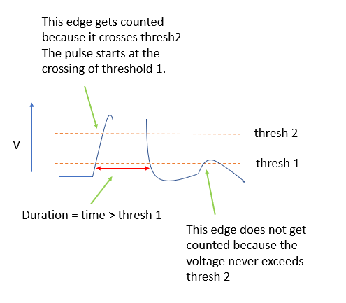

# CatGT User Manual

## Purpose

+ Optionally join trials with given run_name and index ranges [ga,gb] [ta,tb]...
+ ...Or run on any individual file.
+ Optionally apply demultiplexing corrections.
+ Optionally apply band-pass and global CAR filters.
+ Optionally edit out saturation artifacts.
+ By default extract tables of sync waveform edge times to drive TPrime.
+ Optionally extract tables of other nonneural event times to be aligned with spikes.
+ Optionally join the above outputs across different runs (supercat feature).

------

## Install

### (Windows)

1) Copy CatGT-win to your machine, cd into folder.
2) Read this document and the notes in `runit.bat`.

### (Linux)

1) Copy CatGT-linux to your machine, cd into folder.
2) If needed, `> chmod +x install.sh`
3) `> ./install.sh`
4) Read this document and the notes in `runit.sh` wrapper script (required).

### Compatibility (Linux)

- Included libraries are from Ubuntu 16.04 (Xenial).
- Tested with Ubuntu 20.04 and 20.10.
- Tested with Scientific Linux 7.3.
- Tested with Oracle Linux Server 8.3.
- Let me know if it runs on other distributions.

------

## Output

+ Results are placed next to source, named like this, with t-index = 'cat':
`path/run_name_g5_tcat.imec1.ap.bin`.
+ Errors and run messages are appended to `CatGT.log` in the current
working directory.

------

## Usage Quick Ref

### (Windows)

`>runit.bat -dir=data_dir -run=run_name -g=ga,gb -t=ta,tb <which streams> [ options ]`

Notes:

+ Runit.bat can, itself, take command-line parameters; you can still edit runit.bat directly if you prefer.
+ It is easiest to learn by editing a copy of `runit.bat`. Double-click on a bat file to run it.
+ Options must not have spaces, generally.
+ File paths and names must not have spaces (a standard script file limitation).
+ In *.bat files, continue long lines using [space][caret]. Like this: `continue this line ^`.
+ Remove all white space at line ends, especially after a caret (^).
+ Read CatGT.log. There is no interesting output in the command window.

### (Windows with PowerShell)

PowerShell 3.0 and later will parse your parameter list and may complain; it's especially sensitive about supercat command lines. You can prevent that with the "stop-parsing" symbol --%. Use it like this:

`>runit.bat --% -dir=data_dir -run=run_name -g=ga,gb -t=ta,tb <which streams> [ options ]`

### (Linux)

`>runit.sh '-dir=data_dir -run=run_name -g=ga,gb -t=ta,tb <which streams> [ options ]'`

Notes:

+ Enclosing whole linux parameter list in quotes is recommended in general.
+ Enclosing whole linux parameter list in quotes is required for -chnexcl or -supercat.
+ Options must not have spaces, generally.
+ File paths and names must not have spaces (a standard script file limitation).
+ Read CatGT.log. There is no interesting output in the command window.

### Command Line Parameters:

```
Which streams:
-ni                      ;required to process ni stream
-ob                      ;required to process ob streams
-ap                      ;required to process ap streams
-lf                      ;required to process lf streams
-obx=0,3:5               ;if -ob process these OneBoxes
-prb_3A                  ;if -ap or -lf process 3A-style probe files, e.g., run_name_g0_t0.imec.ap.bin
-prb=0,3:5               ;if -ap or -lf AND !prb_3A process these probes

Options:
-no_run_fld              ;older data, or data files relocated without a run folder
-prb_fld                 ;use folder-per-probe organization
-prb_miss_ok             ;instead of stopping, silently skip missing probes
-gtlist={gj,tja,tjb}     ;override {-g,-t} giving each listed g-index its own t-range
-t=cat                   ;extract events from CatGT output files (instead of -t=ta,tb)
-exported                ;apply FileViewer 'exported' tag to in/output filenames
-t_miss_ok               ;instead of stopping, zero-fill if trial missing
-zerofillmax=500         ;set a maximum zero-fill span (millisec)
-no_linefill             ;disable overwriting zero fills with line fills
-startsecs=120.0         ;skip this initial span of each input stream (float seconds)
-maxsecs=7.5             ;set a maximum output file length (float seconds)
-apfilter=Typ,N,Fhi,Flo  ;apply ap band-pass filter of given {type, order, corners(float Hz)}
-lffilter=Typ,N,Fhi,Flo  ;apply lf band-pass filter of given {type, order, corners(float Hz)}
-no_tshift               ;DO NOT time-align channels to account for ADC multiplexing
-loccar_um=40,140        ;apply ap local CAR annulus (exclude radius, include radius)
-loccar=2,8              ;apply ap local CAR annulus (exclude radius, include radius)
-gblcar                  ;apply ap global CAR filter over all channels
-gbldmx                  ;apply ap global demuxed CAR filter over channel groups
-gfix=0.40,0.10,0.02     ;rmv ap artifacts: ||amp(mV)||, ||slope(mV/sample)||, ||noise(mV)||
-chnexcl={prb;chans}     ;this probe, exclude listed chans from ap loccar, gblcar, gfix
-xa=0,0,2,3.0,4.5,25     ;extract pulse signal from analog chan (js,ip,word,thresh1(V),thresh2(V),millisec)
-xd=2,0,384,6,500        ;extract pulse signal from digital chan (js,ip,word,bit,millisec)
-xia=0,0,2,3.0,4.5,2     ;inverted version of xa
-xid=2,0,384,6,50        ;inverted version of xd
-bf=0,0,8,2,4,3          ;extract numeric bit-field from digital chan (js,ip,word,startbit,nbits,inarow)
-inarow=5                ;extractor {xa,xd,xia,xid} antibounce stay high/low sample count
-no_auto_sync            ;disable the automatic extraction of sync edges in all streams
-save=2,0,5,20:60        ;save subset of probe chans (js,ip1,ip2,chan-list)
-sepShanks=0,0,1,2,-1    ;save each shank in sep file (ip,ip0,ip1,ip2,ip3)
-maxZ=0,0,100            ;probe inserted to given depth (ip,depth-type,depth-value)
-pass1_force_ni_ob_bin   ;write pass one ni/ob binary tcat file even if not changed
-supercat={dir,run_ga}   ;concatenate existing output files across runs (see ReadMe)
-supercat_trim_edges     ;supercat after trimming each stream to matched sync edges
-supercat_skip_ni_ob_bin ;do not supercat ni/ob binary files
-dest=path               ;alternate path for output files (must exist)
-no_catgt_fld            ;if using -dest, do not create catgt_run subfolder
-out_prb_fld             ;if using -dest, create output subfolder per probe
```

### Parameter Ordering

You can list parameters on the CatGT command line in any order. CatGT
applies them in the logically necessary order. Of particular note, CatGT
applies filter operations in this order:

- Load data
- Apply any specified biquad (time domain)
- Transform to frequency domain
- TShift
- Apply any specified Butterworth filtering
- Transform back to time domain
- Detect gfix transients for later file editing
- Loccar, gblcar, gbldmx (AP-band only)
- Write file
- Apply gfix transient edits to file

------

## Individual Parameter Notes

### dir

The input files are expected to be organized into folders as SpikeGLX
writes them. CatGT will use your hints {-no_run_fld, -prb_fld} to
automatically generate a path from `data_dir` (the parent directory
of several runs) to the files it needs from `run_name` (this run).
Here are some examples:

- Use `-dir=data_dir -run=run_name -no_run_fld` if the data reside directly
within data_dir without any run folder, as was true in early 3A software,
or if you copied some of your run files without the enclosing run folder.
That is, the data are organized like this:
data_dir/run_name_g0_t0.imec0.ap.bin.

- Use `-dir=data_dir -run=run_name` if you did not select probe folders in
SpikeGLX, that is, the probe data are all at the same level as the NI data
without probe subfolders as in this example:
data_dir/run_name_g0/run_name_g0_t0.imec0.ap.bin.

- Use `-dir=data_dir -run=run_name -prb_fld` if you did select probe folders
in SpikeGLX so that the data from each probe lives in a separate folder
inside the run folder as demonstrated here:
data_dir/run_name_g0/run_name_g0_imec0/run_name_g0_t0.imec0.ap.bin.

Use option `-prb_miss_ok` when run output is split across multiple drives.

>The recently added **obx stream** has small files: just a few analog and
digital channels per file. Like NI files, obx files are always at the
**top level** of the run folder, and are always in the **main (dir-0)
directory** when multidirectory saving is enabled.

### run_name

The input run_name is a base (undecorated) name without g- or t-indices.

### Stream identifiers `{-ni, -ob, -ap, -lf}`

In a given run you might have saved a variety of stream/file types
{nidq.bin, obx.bin, ap.bin, lf.bin}. Use the `{-ni, -ob, -ap, -lf}`
flags to indicate which streams within this run you wish to process.

The -lf option can be used in two ways:

1. If there are .lf. files present in the run folder, which is usual for
1.0-like probes which have a separate LF band, then the {-lf, -lffilter}
options will be applied to those files.

2. If there are no .lf. files already present in the run, then the {-lf,
-lffilter} options are used to generate a downsampled (2500 Hz) lf.bin/meta
file set from the .ap. data if the following conditions are met:

- The .ap. data are full-band.
- -lf is set.
- -lffilter is set (include the low-pass corner!).

The full-band test: A 2.0 probe is always full-band because it has no
LF channel count. A 1.0 stream is full-band if at least one channel's
AP filter is OFF in its IMRO table.

Note that in SpikeGLX you can omit the saving of .lf. files by setting
the `Save chans` string to exclude LF channels. For example, `0:383,768`
with `Force LF` unchecked saves only AP and SY channels. If you've already
saved .lf. files you will have to remove or rename them to allow the
CatGT LF generation to work.

### obx (which OneBox(es))

This designates which OneBoxes to process. OneBox indices are assigned by
SpikeGLX and always start at zero. Unlike probes, all obx files are at
the top level of a run folder (like NI); there are no obx subfolders.

Examples:

- Use `-obx=0` if your run contains one OneBox only.
- Use `-obx=2:4` to process OneBoxes {2,3,4}.
- Use `-obx=1,3:5` to do OneBoxes {1,3,4,5} (skip 2).

### prb_3A

In the early 3A development era there was one and only one probe in a run,
so run names looked like run_name_g0_t0.imec.ap.bin, where the `imec` part
does not have an index. In the 3B phase simultaneous recording from multiple
probes became possible, so the filenames carry an index, e.g., `imec0`,
`imec7`, etc.

### prb (which probe(s))

This designates which probes to process. Probe indices are assigned by
SpikeGLX and always start at zero. Note that if you selected the probe
folders box in SpikeGLX, the data for probe 7 would be output to a
subfolder like this: data_dir/run_name_g0/run_name_g0_imec7.

Examples:

- Use `-prb=0` if your run contains one probe only.
- Use `-prb=2:4` to process probes {2,3,4}.
- Use `-prb=1,3:5` to do probes {1,3,4,5} (skip 2).

### Index range (g-, t- concatenation)

#### Background

During a SpikeGLX run the data samples from the hardware are enqueued into
history streams, one stream for each probe and one for NI data. There are
several options for writing data files while a run is in progress. For
example, all of the data can be saved in a continuous manner, which would
produce a single file named `run_name_g0_t0`. As another example, the
`Enable/Disable Recording` (gate control) button might be pressed several
times creating distinct file-writing epochs, each of which gets its own
`g-index`, e.g., {`run_name_g0_t0`, `run_name_g1_t0`, `run_name_g3_t0`, ...}.
Finally, within each open gate epoch, SpikeGLX can write a programmed
sequence of triggered files, incrementing the `t-index` for each of these,
e.g., {`run_name_g7_t0`, `run_name_g7_t1`, `run_name_g7_t2`, ...}. Note that
triggered sequences share a common run_name and g-index. Note too that each
time the gate reopens, the g-index is advanced and the selected trigger
program will start over again beginning with index t0. In all of these
examples the hardware remains in the running state and file data are being
drawn from the shared underlying history streams. That allows files from
the same run (run_name) to be sewn back together so as to preserve the
timing in the original experiment.

#### Usage notes

CatGT can concatenate files together that come from the same run. That is,
the files have the same base run_name, but may have differing g- and
t-indices.

- Example `-g=0` (or `-g=0,0`): specifies the single g-index `0`.
- Example `-t=5` (or `-t=5,5`): specifies the single t-index `5`.
- Example `-g=1,4`: specifies g-index range `[1,4] inclusive`.
- Example `-t=0,100`: specifies t-index range `[0,100] inclusive`.

When a g-range [ga,gb] and/or a t-range [ta,tb] are specified, concatenation
proceeds like two nested loops:

```
    foreach g in range [ga,gb] {

        // put all the t's together for this g...

        foreach t in range [ta,tb] {

            find input FILE with this g and t

            if found {

                // compare FILE 'firstSample' metadata item
                // to the last sample index in the output...

                if firstSample immediately follows the output
                    append FILE to output
                else if firstSample is larger (a gap)
                    zero-fill gap, then append FILE to output
                else if firstSample is smaller (overlap)
                    move FILE pointer beyond overlap, then append remainder
            }
            else if option t_miss_ok is specified
                fill gap with zeros
            else
                stop processing this stream
        }
    }
```

>You can also concatenate different runs together. To do that, read the
sections under [**Supercat Multiple Runs**](#supercat-multiple-runs).

>As of version 4.4, all zero-filled regions are replaced with line fills.
(See discussion under no_linefill option).

#### Using CatGT output files as input for an extraction pass

Operate on CatGT output files (in order to do event extraction) by
setting the -t parameter to: `-t=cat`. Note that you must specify
the single `ga` that labels that tcat file. (More on this in the
Extractor notes below).

#### Running CatGT on nonstandard file names

This can be done easily by creating symbolic file links that use the
established SpikeGLX g/t naming conventions.

##### (Windows)

1. Create a folder, e.g., 'ZZZ', to hold your symlinks;
it acts like a containing run folder. You can make either a flat
folder organization or a standard SpikeGLX hierarchy; adjust the
CatGT parameters accordingly.
2. Create a .bat script file, e.g., 'makelinks.bat'.
3. Edit makelinks.bat, adding entries for each bin/meta file pair like this:

```
mklink <...ZZZ\goodname_g0_t0.imec0.ap.bin> <path\myoriginalname.bin>
mklink <...ZZZ\goodname_g0_t0.imec0.ap.meta> <path\myoriginalname.meta>
```

> Set the g/t indices to describe the concatenation order you want.

4. Close makelinks.bat.
5. Right-click on makelinks.bat and select `Run as administrator`.

##### (Linux)

1. Create a folder, e.g., 'ZZZ', to hold your symlinks;
it acts like a containing run folder. You can make either a flat
folder organization or a standard SpikeGLX hierarchy; adjust the
CatGT parameters accordingly.
2. Create a .sh script file, e.g., 'makelinks.sh'.
3. Edit makelinks.sh, adding entries for each bin/meta file pair like this:

```
#!/bin/sh

ls -s <path/myoriginalname.bin> <...ZZZ/goodname_g0_t0.imec0.ap.bin>
ls -s <path/myoriginalname.meta> <...ZZZ/goodname_g0_t0.imec0.ap.meta>
```

> Set the g/t indices to describe the concatenation order you want.

4. Close makelinks.sh, set its executable flag, run it.

### Missing files and gap zero-filling

You can control how CatGT works during file concatenation when one or more
of your input files is missing, or, if input file `N+1` starts later in
time than the end of input file `N`; what we term a "gap" in the recording.

If you do not use the `-t_miss_ok` option, the default behavior is to
require all files in the series to be present. Processing of a stream
will stop if a binary or meta file is not found. If the expected file
set is found but there is a gap between the files, the gap is filled
with zeros for all channels. If instead, adjacent files overlap in
time, the overlap region is represented just once in the output file.

If you include `-t_miss_ok` in the command line, then processing does
not stop. Rather, the entire missing file (or run of consecutive
missing files) is counted as an extended gap. The gap is replaced by
zeros when a next expected file set is found.

By default, CatGT zero-fills gaps so as to precisely preserve the real-
world duration of the recording. This enables the spikes and other nonneural
events that are present in the output file to be temporally aligned with
other recorded data streams in the experiment.

However, you might not be interested in aligning the data to other streams,
so feel that zeros in the output are wasted space. Moreover, some spike
sorting programs are known to crash because they cannot handle long spans
of time with no detected spikes. Option `zerofillmax` allows you to set an
upper limit on the span of zeros that can be inserted.

For example, `zerofillmax=500` directs that gaps whose true length is
<= 500 ms are filled by the equivalent-length span of zeros, but longer
spans are capped at 500 ms of zeros.

Setting `zerofillmax=0` specifies that zero-filling is disabled.

>All detected gaps are noted in the CatGT log file. The log entries
indicate the time (samples from file start) in the output file that
the gap starts, the true length of the gap in the original file set,
and the length of the zero-filled span in the output file.

>As of version 4.4, all zero-filled regions are replaced with line fills.
(See discussion under no_linefill option).

### Output files

- New .bin/.meta files are output only in these cases:
    1. A range of files is to be concatenated, that is, (gb > ga) or
    (tb > ta).
    2. If filters, tshift or startsecs are applied, so the binary data are altered.

- If you do not specify the `-dest` option, output files are stored in the
same folder as their input files.

- If a range of g-indices was specified `-g=ga,gb` the data are all written
to the `ga` folder. Such output files look like
`path/run_name_g2_tcat.imec1.ap.bin`, that is, the g-index is set to the
lowest specified input g-index, and the t-index becomes `tcat` to indicate
this file contains a range.

- The `tcat` naming convention is used even if a range in g is specified,
e.g., `-g=0,100`, but there is just one t-index for each gate `t=0`.

- The `-dest=myPath` option will store the output in a destination folder
of your choosing. If you do not specify the `-no_catgt_fld` option, it will
further create an output subfolder for the run having a `catgt_` tag:
`myPath/catgt_run_name_ga`.

- A meta file is also created for each output binary, e.g.:
`path/run_name_g5_tcat.imec1.ap.meta`.

- The meta file also gets `catGTCmdlineN=<command line string>`.

- The meta item e.g., `catNFiles`, indicates count of concatenated files.

- The meta item e.g., `catGVals=0,1`, indicates range of g-indices used.

- The meta item e.g., `catTVals=0,20`, indicates range of t-indices used.

- CatGT creates a pass-1 output file:
`output_path/run_ga_ct_offsets.txt`.
This tabulates, for each stream, where the first sample of each input
file is relative to the start of the concatenated output file. It records
these offsets in units of samples, and again in units of seconds on that
stream's clock.

- CatGT always creates output file: `output_path/run_ga_fyi.txt`.
This lists key output paths and filenames you can use to build downstream
command lines for supercat or TPrime.

### gtlist option

This option overrides the `-g=` and `-t=` options so that you can specify
a separate t-range for each g-index. Specify the list like this:

`-gtlist={g0,t0a,t0b}{g1,t1a,t1b}...` *(include the curly braces)*.

>With this option the g- and t- values in each list element have to be
integers >= 0. You can't use `t=cat` here.

### no_linefill option

As of version 4.4, CatGT replaces all zero-filled regions with line fills.
This replacement is applied both to gaps between files and to gfix edits.
Each zero-fill segment has real voltage value bounding it to the left (A)
and a real voltage bound to the right (B). A line fill overwrites the zero
voltage segment between A and B with a smoothly varying line segment that
connects A to B. This smooths the voltage change through time and removes
step-changes at A and B. Line-filling thereby suppresses the generation of
artifacts that might occur if CatGT output is passed though additional
downstream filters.

Disable line-filling with the -no_linefill option, which instead, uses the
zero-filling of previous versions.

### startsecs option

Use this to start reading each input stream after a specified offset from
the stream's beginning (float seconds). Note that an error will be flagged
if this value exceeds the length of the first file in a concatenation series.

### apfilter and lffilter options

Digital filtering is separately specified for probe AP and LF bands. CatGT
offers these filter options (xx = {ap, lf}):

- xxfilter=biquad,2,Fhi,Flo ; order-2 band-pass
- xxfilter=biquad,2,Fhi,0   ; order-2 high-pass
- xxfilter=biquad,2,0,Flo   ; order-2 low-pass

The biquad is a second order time-domain filter (the order parameter is
actually ignored as it must be 2). Our biquad band-pass is implemented
as a high-pass followed by a low-pass. We apply all biquads in the forward
direction only, making this a causal filter. There is always some phase
error associated with causal filtering. This shouldn't disrupt the ability
to distinguish waveforms from one another in spike sorting, yet the shapes
will differ somewhat from their unfiltered counterparts. This had been the
default type of filtering applied in CatGT through version 2.1.

- xxfilter=butter,N,Fhi,Flo ; order-N band-pass
- xxfilter=butter,N,Fhi,0   ; order-N high-pass
- xxfilter=butter,N,0,Flo   ; order-N low-pass

Our Butterworth filters are implemented in the frequency domain. As such
they are always acausal (zero phase error). The rate of roll-off of the
FFT implementation is about a factor of two slower than in the time domain.
For example, to match the result of a single pass (forward-only) order-3
Butterworth (as per MATLAB filter()), specify order 6 here. To match
forward-backward time-domain filtering with an order-3 (as per MATLAB
filtfilt()), which doubles the effective order, specify order 12 here.

#### no_tshift option

Imec probes digitize the voltages on all of their channels during each
sample period (~ 1/(30kHz)). However, the converting circuits (ADCs) are
expensive in power and real estate, so there are only a few dozen on the
probe and they are shared by the ~384 channels. The channels are organized
into multiplex channel groups that are digitized together, consequently each
group's actual sampling time is slightly offset from that of other groups.

CatGT automatically applies an operation we call `tshift` to undo the
effects of multiplexing by temporally aligning channels to each other. Note
that the "shift" is smaller than one sample so file sizes do not change.
Rather, the amplitude is redistributed among existing samples. Tshift
improves the results of operations that compare or combine different
channels, such as global CAR filtering or whitening. The FFT-based correction
method was proposed by Olivier Winter of the International Brain Laboratory.

Note that tshift and band-pass filtering should always be done on Neuropixel
probe data. The issue is only whether these are applied by CatGT or by some
other component of your analysis pipeline.

- Use option `-no_tshift` to disable CatGT's automatic tshift.

### loccar_um/loccar option

- Do CAR common average referencing on an annular area about each site.
- The average is shank-specific, including only channels/sites on the same
shank as the center site.
- Specify an excluded inner radius and an outer averaging radius.
- Use a high-pass filter also, to remove DC offsets.
- You may select only one of {`-loccar`, `-gblcar`, `-gbldmx`}.

Use option -loccar_um to specify the radii in microns. This requires the
presence of `~snsGeomMap` in the metadata, which will be standard for
SpikeGLX versions 20230202 and later. The inner radius must be at least
10 microns.

Use option -loccar to specify the radii in numbers of rows/columns. This
requires the presence of `~snsShankMap` in the metadata, which will be
eliminated in SpikeGLX versions 20230202 and later. The inner radius
must be at least 1.

>*Use the SpikeGLX FileViewer to look at traces pre- and post-CAR to
see if this filter option is working for your data. A danger of loccar
is excessive reduction of the amplitude of large-footprint spikes.*

### gblcar option

>*Note: Prior to CatGT version 3.6 the subtracted value had been the
statistical average (mean) over all channels. Starting with version
3.6 the median value is used instead to reduce outlier bias.*

- Do CAR common median referencing using all channels.
- The median is probe-wide, including channels/sites on all shanks.
- Unused channels are excluded, see [chnexcl option](#chnexcl-option).
- Note that `-gblcar` is never applied to the LFP band.
- Note that `-gblcar` assumes fairly uniform background across all channels.
- Use a high-pass filter also, to remove DC offsets.
- You may select only one of {`-loccar`, `-gblcar`, `-gbldmx`}.

>*Use the SpikeGLX FileViewer to look at traces pre- and post-CAR to
see if this filter option is working for your data. A danger of gblcar
is that the probe is sampling tissue layers with two or more distinct
backgrounds. That can create artifacts that look like small amplitude
spikes. If that is happening, instead of `-gblcar`, try a more localized
but still large averaging area using `-loccar_um=60,480` for example.
Think of this geometry not as a small ring, but as a 960 um averaging
block about each site. Choose a block size that works best for the layer
thickness. Note too that we suggested an inner exclusion radius larger
than 2 row-steps to avoid including the spike, itself, in the averaging
block.*

### gbldmx option

- Do demuxed CAR common average referencing, yes, average.
- This works on groups of channels that are digitized at the same time.
- All shanks are included in the groups.
- Unused channels are excluded, see [chnexcl option](#chnexcl-option).
- Note that `-gbldmx` is never applied to the LFP band.
- Note that `-gbldmx` assumes fairly uniform background across all channels.
- Use a high-pass filter also, to remove DC offsets.
- You may select only one of {`-loccar`, `-gblcar`, `-gbldmx`}.

Generally we recommend gblcar which considers all channels together and is
more robust against outlier values than gbldmx. However, for rare cases
of high frequency noise (>15kHz), gbldmx may do a better job. Because
fewer channels are included (and averaged), larger correction factors may
be subtracted, and that can produce overcorrection artifacts that look like
small inverted spikes.

### gfix option

Light or chewing artifacts often make large amplitude excursions on a
majority of channels. This tool identifies them and cuts them out,
replacing with zeros. You specify three things.

1. A minimum absolute amplitude in mV (zero ignores the amplitude test).
2. A minimum absolute slope in mV/sample (zero ignores the slope test).
3. A noise level in mV defining the end of the transient.

- Yes, `-gblcar` and `-gfix` make sense used together.

>*You are strongly advised to apply high-pass filtering when using -gfix
because the result of -gfix is to zero the output. This makes step
transitions which will be smaller if the DC-component is removed.*

>As of version 4.4, all zero-filled regions are replaced with line fills.
(See discussion under no_linefill option).

#### Tuning gfix parameters

Use the SpikeGLX FileViewer to select appropriate amplitude and slope
values for a given run. Be sure to turn high-pass filtering ON and spatial
`<S>` filters OFF to match the conditions the CatGT artifact detector will
use. Zoom the time scale (ctrl + click&drag) to see the individual sample
points and their connecting segments. Set the slope this way: Zoom in on
the artifact initial peak, the points with greatest amplitude.
Suppose consecutive points {A,B,C,D} make up the peak and {B,C,D} exceed
the amplitude threshold. Then there are three slopes {B-A,C-B,D-C}
connecting these points. Select the largest value. That is, set the
slope to the fastest voltage change near the peak. An artifact will
usually be several times faster than a neuronal spike.

### chnexcl option

Use this option to prevent bad channels from corrupting calculations over
mixtures of channels, such as the spatial filters {loccar, gblcar, gfix}.

The option `-chnexcl={probe;chan_list}{probe;chan_list}...` takes a list of
elements *(include the curly braces)* that specify a probe index; and a
list of channels to exclude for that probe. Channel lists are specified
like page lists in a printer dialog, `1,10,40:51` for example. Be careful
to use a semicolon (;) between probe and channel list, and use only commas
and colons (,:) within your channel lists. Include no more than one excluded
channel list for a given probe index.

Note that the CatGT spatial filters honor metadata items `~snsGeomMap`
and `~snsShankMap`. The GeomMap replaces the ShankMap in metadata as of
SpikeGLX version 20230202.

A GeomMap has an entry for each saved channel that describes the
(shank, x(um), z(um)) where its electrode resides on the shank, and a fourth
0/1 value, `use flag`, indicating if the channel should be used in spatial
filtering. By default, SpikeGLX marks known on-shank reference channels
with zeroes. Your chnexcl data force the corresponding use flags to zero
before the filters are applied, and the modified `~snsGeomMap`, if present,
is written to the CatGT output metadata.

A ShankMap has an entry for each saved channel that describes the
(shank, col, row) where its electrode resides on the shank, and a fourth
0/1 value, `use flag`, indicating if the channel should be used in spatial
filtering. By default, SpikeGLX marks known on-shank reference channels
with zeroes. Your chnexcl data force the corresponding use flags to zero
before the filters are applied, and the modified `~snsShankMap`, if present,
is written to the CatGT output metadata.

### Extractors

>*Starting with version 3.0, CatGT extracts sync edges from all streams
by default, unless you specify the `-no_auto_sync` option (see below).*

There are five extractors for scanning and decoding nonneural data
channels in any data stream. They differ in the data types they operate
upon:

- xa: Finds positive pulses in any analog channel.
- xd: Finds positive pulses in any digital channel.
- xia: Finds inverted pulses in any analog channel.
- xid: Finds inverted pulses in any digital channel.
- bf: Decodes positive bitfields in any digital channel.

The first three parameters of any extractor specify the stream-type,
stream-index and channel (16-bit word) to operate on, E.g.:

-xa=**js,ip,word**, &#60;additional parameters&#62;

#### Extractors js (stream-type):

- **NI**: js = 0 (any extractor).
- **OB**: js = 1 (any extractor).
- **AP**: js = 2 (only {xd, xid} are legal).

>*Extractors do not work on LF files.*

#### Extractors ip (stream-index)

- **NI**: ip = 0 (there is only one NI stream).
- **OB**: ip = 0 selects obx0, ip = 7 selects obx7, etc.
- **AP**: ip = 0 selects imec0, ip = 7 selects imec7, etc.

#### Extractors word

Word is a zero-based channel index. It selects the 16-bit data word to
process.

word = -1, selects the last word in that stream. That's especially useful
to specify the SY word at the end of a OneBox or probe stream.

>It may be helpful to review the organization of words and bits in data
streams in the
[SpikeGLX User Manual](https://github.com/billkarsh/SpikeGLX/blob/master/Markdown/UserManual.md#channel-naming-and-ordering).

#### Extractors positive pulse

1. starts at low **non-negative** baseline (below threshold)
2. has a leading/rising edge (crosses above threshold)
3. (optionally) stays high/deflected for a given duration
4. has a trailing/falling edge (crosses below threshold)

The positive pulse extractors **{xa, xd}** make text files that report
the times (seconds) of the leading edges of matched pulses.

#### Extractors xa

Following **-xa=js,ip,word**, these parameters are required:

- Primary threshold-1 (V).
- Optional more stringent threshold-2 (V).
- Milliseconds duration.

If your signal looks like clean square pulses, set threshold-2 to be closer
to baseline than threshold-1 to ignore the threshold-2 level and run more
efficiently. For noisy signals or for non-square pulses set threshold-2 to
be farther from baseline than theshold-1 to ensure pulses attain a desired
deflection amplitude. Using two separate threshold levels allows detecting
the earliest time that pulse departs from baseline (threshold-1) and
separately testing that the deflection is great enough to be considered a
real event and not noise (threshold-2). See Fig. 1.



#### Extractors xd

Following **-xd=js,ip,word**, these parameters are required:

- Index of the bit in the word.
- Milliseconds duration.

#### Extractors both xa and xd

- All indexing is zero-based.

- Milliseconds duration means the signal must remain deflected from
baseline for that long.

- Milliseconds duration can be zero to specify detection of all leading
edges regardless of pulse duration.

- Milliseconds duration default precision (tolerance) is **+/- 20%**.
    * Default tolerance can be overridden by appending it in milliseconds
    as the last parameter for that extractor.
    * Each extractor can have its own tolerance.
    * E.g., -xd=js,ip,word,bit,100   seeks pulses with duration in default
    range [80,120] ms.
    * E.g., -xd=js,ip,word,bit,100,2 seeks pulses with duration in specified
    range [98,102] ms.

- A given channel or even bit could encode two or more types of pulse that
have different durations, e.g., `-xd=0,0,8,0,10 -xd=0,0,8,0,20` scans and
reports both 10 and 20 ms pulses on the same line.

- Each option, say `-xd=2,0,384,6,500`, creates an output file whose name
reflects the parameters, e.g., `run_name_g0_tcat.imec0.ap.xd_384_6_500.txt`.

- The threshold is not encoded in the `-xa` filename; just word and
milliseconds.

- The `run_ga_fyi.txt` file lists the full paths of all generated
extraction files.

- The files report the times (s) of leading edges of detected pulses;
one time per line, `\n` line endings.

- The time is relative to the start of the stream in which the pulse is
detected (native time).

#### Extractors inverted pulse

1. starts at high **positive** baseline (above threshold)
2. has a leading/falling edge (crosses below threshold)
3. (optionally) stays low/deflected for a given duration
4. has a trailing/rising edge (crosses above threshold)

>*Although the shape is "inverted," these pulses are nevertheless entirely
non-negative.*

The inverted pulse extractors **{xia, xid}** make text files that report
the times (seconds) of the leading edges of matched pulses.

The inverted pulse versions work exactly the same way as their positive
counterparts. Just keep in mind that inverted pulses have a high baseline
level and deflect toward lower values.

#### Extractors bf (bit-field)

The -xd and -xid options treat each bit of a digital word as an individual
line. In contrast, the -bf option interprets a contiguous group of bits
as a non-negative n-bit binary number. The -bf extractor reports value
transitions: the newest value and the time it changed, in two separate files.
Following **-xa=js,ip,word**, the parameters are:

* **startbit**: lowest order bit included in group (range [0..15]),
* **nbits**: how many bits belong to group (range [1..<16-startbit>]).
* **inarow**: a real value has to persist this many samples in a row (1 or higher).

In the following examples we set inarow=3:

* To interpret all 16 bits of NI word 5 as a number, set
-bf=0,0,5,0,16,3.

* To interpret the high-byte as a number, set -bf=0,0,5,8,8,3.

* To interpret bits {3,4,5,6} as a four-bit value, set -bf=0,0,5,3,4,3.

You can specify multiple -bf options on the same command line. The words
and bits can overlap.

Each -bf option generates two output files, named according to the
parameters (excluding inarow), for example:

* `run_name_g0_tcat.nidq.bfv_5_3_4.txt`.
* `run_name_g0_tcat.nidq.bft_5_3_4.txt`,

The two files have paired entries. The `bfv` file contains the decoded
values, and the `bft` file contains the time (seconds from file start)
that the field switched to that value.

#### Extractors inarow option

The pulse extractors **{xa,xd,xia,xid}** use edge detection. By default,
when a signal crosses from low to high, it is required to stay high for
at least 5 samples. Similarly, when crossing from high to low the signal
is required to stay low for at least 5 samples. This requirement is applied
even when specifying a pulse duration of zero, that is, it is applied to
any edge. This is done to guard against noise.

You can override the count giving any value >= 1.

#### Extractors no_auto_sync option

Starting with version 3.0, CatGT automatically extracts sync edges
from all streams unless you turn that off using `-no_auto_sync`.

For an NI stream, CatGT reads the metadata to see which analog or digital
word contains the sync waveform and builds the corresponding extractor for
you, either `-xa=0,0,word,thresh,0,500` or `-xd=0,0,word,bit,500`.

For OB and AP streams, CatGT seeks edges in bit #6 of the SY word, as if
you had specified `-xd=1,ip,-1,6,500` and/or `-xd=2,ip,-1,6,500`.

### -t=cat defer extraction to a later pass

You might want to concatenate/filter the data in a first pass, and later
extract nonneural events from the ensuing output files which are now named
`tcat`. Do that by specifying `-t=tcat` in the second pass.

>NOTE: If the files to operate on are now in an output folder named
`catgt_run_name` then *DO PUT* tag `catgt_` in the `-run` parameter
like example (2) below:

>NOTE: Second pass is restricted to event extraction. An error is flagged
if the second pass specifies any concatenation or filter options. Extraction
passes should always include -no_tshift.

**Examples**

- (1) Saving to native folders --
    + Pass 1: `>CatGT -dir=aaa -run=bbb -g=ga,gb -t=ta,tb`.
    + Pass 2: `>CatGT -dir=aaa -run=bbb -g=ga -t=cat -no_tshift`.

- (2) Saving to dest folders --
    + Pass 1: `>CatGT -dir=aaa -run=bbb -g=ga,gb -t=ta,tb -dest=ccc`.
    + Pass 2: `>CatGT -dir=ccc -run=catgt_bbb -g=ga -t=cat -dest=ccc -no_tshift`.

### save option

By default CatGT reads and writes all of the channels in a binary input file.
However, for probe bin files, you can write out a subset of the channels.
This is analogous to SpikeGLX selective channel saving, and to the FileViewer
export feature. You might use this to eliminate noisy or uninteresting
channels, or to split out the shanks of a multishank probe.

-save=js,ip1,ip2,channel-list

* **js,ip1**: Identify the input probe stream, where, js = input stream type = {2=AP, 3=LF}.
* **ip2**: User-provided output stream number; a non-negative integer that
can be the same as ip1 or not (see examples below).
* **channel-list**: Standard SpikeGLX-type list of channels; these name
originally acquired channels.
* You can enter as many -save options on one command line as needed,
and several options can refer to the same input file if needed:
**One file in -> many files out**.
* Internally, the -sepShanks and -maxZ options automatically generate
additional -save options.
* For each -save option that remaps an input ip1 to a new ip2, the
`run_ga_fyi.txt` file adds entries to connect the new ip2-labeled output
to its ip1-labeled digital extractions (see example 2).

>*Be sure to name the SYNC channel(s) or they will not be saved.*

>*If processing a 1.0 LF input file, use js = 3 to match the input file type,
and use channel indices appropriate for the 1.0 LF-band, that is, values in
range [384,768].*

>*If processing a 2.0 AP input file -> LF output file, use js = 2 to match
the input file type, and use channel indices appropriate for the 2.0 full-band,
that is, values in range [0,383] and SY [384].*

>*If processing a quad-probe input file, in all cases use js = 2 to match
the input file type, and use channel indices appropriate for the quad full-band,
that is, values in range [0,1535] and SY [1536:1539].*

#### Example 1

Remove the first ten channels [0..9] from NP 1.0 file imec0.ap.bin that
was originally written with all AP channels saved.

-save=2,0,0,10:383,768

* The input stream imec0.ap has (js,ip1) = (2,0).
* We will write it out also as imec0.ap, so ip2 = 0.
* There are 384 neural channels [0..383], and the final sync channel is 768.

#### Example 2

NP 2.0 single-shank file imec3.ap.bin was originally written with SpikeGLX
selective saving enabled; omitting the first 100 channels because they were
uninteresting. Hence, the input file to CatGT contains channels [100..384].
Here we will keep only the lowest ten channels and the sync channel,
renaming it to imec5.ap.

-save=2,3,5,100:109,384

* Notice that the channel indices are given with respect to the original
data stream rather than the saved file.

**Example 2 FYI Entries**

The `fyi` file gets additional entries to help you connect renamed binary
output files with the digital extractions (like sync edges) that they are
paired with...

Suppose auto-sync is in effect. With or without this -save option, the
output fyi file for the run would point at the extracted sync edges
using this entry:

```
sync_imec3=path/run_name_g0_tcat.imec3.ap.xd_384_6_500.txt
```

Because this -save option remaps ip=3 to ip=5, the fyi file also gets this
entry:

```
sync_imec5=path/run_name_g0_tcat.imec3.ap.xd_384_6_500.txt
```

Likewise, any custom extraction for the input ip1 would generate entries
like this:

```
times_imec3_0=path/extraction_output_file_3
times_imec5_0=path/extraction_output_file_3
```

#### Example 3

Split NP 2.0 4-shank stream imec0.ap (all channels saved) into four shanks,
giving each a new stream number. The original imro selected the lowest
(384/4 = 96) electrodes from each shank.

-save=2,0,10,0:47,96:143,384
-save=2,0,11,48:95,144:191,384
-save=2,0,12,192:239,288:335,384
-save=2,0,13,240:287,336:384

### sepShanks option

This is a convenient way to split a multishank probe (js=2) into its
respective shanks.

-sepShanks=ip,ip0,ip1,ip2,ip3

* **ip**: Identifies the input probe stream.
* **ip0:ip3**: User-provided output stream numbers, one for each of up to
4 shanks. Each ipj maps shank-j to a file index that you assign.
* Generally the ipj should be unique (separate files).
* One of the ipj can be the same as input stream: ip.
* One or more ipj can be -1 to omit that shank.
* If the imro selects no sites on a given shank, that shank is omitted.
* The SY channel(s) are automatically included.
* Include no more than one -sepShanks option for a given probe index.

#### Example 1

(Same case as Example 3 under the -save option)

Split NP 2.0 4-shank stream imec0.ap (all channels saved) into four shanks,
giving each a new stream number.

-sepShanks=0,10,11,12,13

#### Example 2

Save only the second shank for 4-shank stream imec5.ap.

-sepShanks=5,-1,5,-1,-1

### maxZ option

It's very common to insert a probe only partially into the brain. The
electrodes that remain outside the brain see primarily environment noise.
These channels pollute CAR operations unless they are excluded. Also,
you can trim these channels out of your files to make them smaller.

Use maxZ to specify an insertion depth for an imec probe (js=2). This
will automatically create/adjust the -chnexcl option for the probe, and
it will create a -save option (if you don't already have one) listing only
the inserted channels. Existing -save options are also edited (see note below).
Include no more than one -maxZ option for a given probe index.

The parameters are -maxZ=ip,depth-type,depth-value.

There are three convenient ways to specify the insertion depth:

|Depth-type     | Depth-value|
|---------------| ---------------|
|---------------| ---------------|
|0              | zero-based row index|
|1              | microns in geomMap (z=0 at center of bottom row)|
|2              | microns from tip (z=0 at probe tip)|

> Note that you can specify your own -chnexcl entry and -maxZ for the same
probe (ip); the result is the union: excluding everything you specified
with -chnexcl AND excluding channels that are outside the brain via -maxZ.

> You can also specify your own (-save or -sepShanks) option and -maxZ for
the same probe. In this case each (-save or -sepShanks) option is edited
to produce the intersection: those channels you specified via
(-save or -sepShanks) that are also within the brain via -maxZ.

------

## Supercat Multiple Runs

You may want to concatenate the output {bin, meta, extractor} files from
two or more different CatGT runs, perhaps, to spike-sort them jointly and
look for persistent units over several days. You can do that in a two-step
process by (1) running CatGT normally, `"pass 1"`, for each of the separate
runs to generate their tcat-tagged output files, and then (2) running CatGT
on those tcat outputs `"pass 2"` using the `-supercat` option as described
in this section.

## --- Building The Supercat Command Line ---

### supercat option

The new option `-supercat={dir,run_ga}{dir,run_ga}...` takes a list of
elements *(include the curly braces)* that specify which runs to join and
in what order (the order listed). Remember that CatGT lets you store run
output either in the native input folders or in a separate dest folder.
Here's how to interpret and set a supercat element depending on how you
did that CatGT run:

**Example**

- (1) Saved to native folders **with run folder** --
    + dir:    The parent directory of the run folder.
    + run_ga: The name of the run folder **including g-index**.

- (2) Saved to native folders **without run folder (-no_run_fld option)** --
    + dir:    The parent directory of the data files themselves.
    + run_ga: The run_name and g-index parts of the tcat output files.
    + *You must use -no_run_fld for the supercat run*.

- (3) Saving to dest folders **with catgt_ folder** --
    + dir:    The parent directory of the catgt_run_ga folder.
    + run_ga: 'catgt_' tagged folder name, e.g., **catgt_myrun_g7**.

- (4) Saving to dest folders **without catgt_ folder (-no_catgt_fld option)** --
    + dir:    The parent directory of the data files themselves.
    + run_ga: The run_name and g-index parts of the tcat output files.
    + *You must use -no_run_fld for the supercat run*.

>Note that if `-no_run_fld` is used, it is applied to all elements.

>Note that in linux, curly braces will be misinterpreted, unless you
enclose the whole parameter list in quotes:<br>
> **> runit.sh 'my_params'**

>Each pass1 run generates an output file: `output_path/run_ga_fyi.txt`,
containing an entry: `supercat_element`. These entries make it much easier
to construct your supercat command line.

### supercat_trim_edges option

When SpikeGLX writes files, the first samples written are aligned as closely
as possible across each of the streams, either using elapsed time, or using
sync if enabled for the run. However, the trailing edges of the files,
that is, the last samples written, are not tightly controlled unless you
selected a trigger mode that sets a fixed time span for the files. Said
another way, the starts of files in a run are aligned, but the lengths
of the files are ragged (differences of ~thousandth of a second).

>As of version 3.6 pass1 CatGT runs trim any trailing ragged edges to
even-up the stream lengths.

By default, supercat just sews the files from different runs together end
to end without regard for the differences in length of different streams.
However, when the supercat_trim_edges option is enabled, supercat does more
work to trim the files so that the different streams stay better aligned and
closer to the same length. In particular, between each pair of adjacent
runs (A) and (B):

- The trailing edge of each stream of (A) is cut at a sync edge (the same
edge in each stream). The edge itself is kept in the output.

- The leading edge of each stream of (B) is cut at a sync edge (the same
edge in each stream). The edge itself is omitted so that the output has
one unambiguous edge at the boundary.

- Any/all extraction files for a given stream are edited/trimmed in tandem
with the stream's binary files.

>This option requires:
>
> - Sync was enabled in SpikeGLX for each run being supercatted.
> - Sync edges are extracted from each stream during pass 1.
> - Option zerofillmax should not be used during pass 1.
> - Option maxsecs is discouraged during pass 1.

>Note that to supercat lf files, we need their sync edges which can only
>be extracted/derived from their ap counterparts:
>
> - During pass 1, specify (-ap); do not specify -no_auto_sync.

### supercat_skip_ni_ob_bin option & pass1_force_ni_ob_bin

Your first-pass CatGT runs might have extracted edge files but produced
no new binary NI or OB files (that happens if no trial range is specified
in the g- or t-indices). The supercat_skip_ni_ob_bin option reminds supercat
not to process the missing binary files.

On the other hand, you might want to make a supercat of NI or OB binary
files even though you aren't modifying those data in the first pass. In
that case, do the first pass with `pass1_force_ni_ob_bin` which will ensure
that the NI and OB binary files are made and tagged `tcat` so supercat can
find them.

>Any operations on a stream always produce a new 'tcat' meta file so that
supercat can later track file lengths.

### supercat (other parameters)

Here's how all the other parameters work for a supercat session...

>Note that each option is global and will apply to all of the supercat elements.

```
Standard:
-dir                     ;ignored (parsed from {dir,run_ga})
-run                     ;ignored (parsed from {dir,run_ga})
-g=ga,gb                 ;ignored (parsed from {dir,run_ga})
-t=ta,tb                 ;ignored (assumed to be t=cat)

Which streams:
-ni                      ;required to supercat ni stream
-ob                      ;required to supercat ob streams
-ap                      ;required to supercat ap streams
-lf                      ;required to supercat lf streams
-obx=0,3:5               ;if -ob supercat these OneBoxes
-prb_3A                  ;if -ap or -lf supercat 3A-style probe files, e.g., run_name_g0_tcat.imec.ap.bin
-prb=0,3:5               ;if -ap or -lf AND !prb_3A supercat these probes

Options:
-no_run_fld              ;older data, or data files relocated without a run folder
-prb_fld                 ;use folder-per-probe organization
-prb_miss_ok             ;instead of stopping, silently skip missing probes
-gtlist={gj,tja,tjb}     ;ignored (parsed from {dir,run_ga})
-exported                ;apply FileViewer 'exported' tag to in/output filenames
-t_miss_ok               ;ignored
-zerofillmax=500         ;ignored
-no_linefill             ;ignored
-startsecs=120.0         ;ignored
-maxsecs=7.5             ;ignored
-apfilter=Typ,N,Fhi,Flo  ;ignored
-lffilter=Typ,N,Fhi,Flo  ;ignored
-no_tshift               ;ignored
-loccar_um=40,140        ;ignored
-loccar=2,8              ;ignored
-gblcar                  ;ignored
-gbldmx                  ;ignored
-gfix=0.40,0.10,0.02     ;ignored
-chnexcl={prb;chans}     ;ignored
-xa=0,0,2,3.0,4.5,25     ;required if joining this extractor type
-xd=2,0,384,6,500        ;required if joining this extractor type
-xia=0,0,2,3.0,4.5,25    ;required if joining this extractor type
-xid=2,0,384,6,500       ;required if joining this extractor type
-bf=0,0,8,2,4,3          ;required if joining this extractor type
-inarow=5                ;ignored
-no_auto_sync            ;forbidden with supercat_trim_edges
-save=2,0,5,20:60        ;ignored
-sepShanks=0,0,1,2,-1    ;ignored
-maxZ=0,0,100            ;ignored
-pass1_force_ni_ob_bin   ;ignored
-dest=path               ;required
-no_catgt_fld            ;ignored
-out_prb_fld             ;create output subfolder per probe
```

>Note that you need to provide the same extractor parameters that were used
for the individual runs. Although supercat doesn't do extraction, it needs
the parameters to create filenames.

## --- Supercat Behaviors ---

### Zero filling

There is no zero filling in supercat. Joining is done end-to-end. Missing
files cause processing to stop, with one exception: You can legally skip
probes using the `-prb_miss_ok` option. This allows the data to have been
saved in a multidirectory fashion where not all probes will be in a given
run folder.

Otherwise:

- Every run specified in the supercat list is required to exist.
- Every file type {bin, meta, extractor} being joined must exist in each run.

>Note that supercat will check if the channel count matches from run to run
and flag an error if not. However, beyond that, only you know if it makes
any sense to join these runs together.

### supercat output

You must provide an output directory using the `-dest` option. CatGT will
use the `run_ga` parts of the first listed supercat element to create a
subfolder in the dest directory named `supercat_run_ga` and place the
results there.

The output metadata will **NOT** contain any of these pass-1 tags:

- `catGTCmdlineN : N in range [0..99]`
- `catNFiles`
- `catGVals`
- `catTVals`

The output metadata **WILL** contain these supercat tags:

- `catGTCmdline`
- `catNRuns`

As runs are joined, supercat will automatically offset the times within
extracted edge files. The offset for the k-th listed run is the sum of
the file lengths for runs 0 through k-1.

Supercat creates output file:
`dest/supercat_run_ga/run_ga_sc_offsets.txt`.
This tabulates, for each stream, where the first sample of each input
"tcat" file is relative to the start of the concatenated output file. It
records these offsets in units of samples, and again in units of seconds
on that stream's clock.

Supercat creates output file: `dest/supercat_run_ga/run_ga_fyi.txt`.
This lists key output paths and filenames you can use to build downstream
command lines for TPrime.

------

## Change Log

Version 4.4

- Support NP1221 probes.
- Support NP2020 quad-probes.
- Support NXT probes.
- This version inverts NXT voltages.
- Fix overlap handling when zerofillmax applied.
- Smoother transitions at FFT boundaries.
- linefill is automatic; disable with -no_linefill.
- Allow -maxZ and -save options on same probe.
- Add -sepShanks option.

Version 4.3

- Supercat can join runs with varied sample rates.

Version 4.2

- Add -no_catgt_fld option.

Version 4.1

- Add -maxZ option.

Version 4.0

- Update probe support.

Version 3.9

- Fix supercat of LF files.

Version 3.8

- Fix crash when no CAR options specified.
- Restore option -gbldmx.
- Support probes {2003,2004,2013,2014}.

Version 3.7

- Add ~snsGeomMap awareness.
- Add -loccar_um option.

Version 3.6

- Option -gblcar uses median rather than mean.
- Trim pass1 file sets to same length.
- Add option -save (selective channel saving).

Version 3.5

- Support latest probes.

Version 3.4

- Add option -startsecs.
- Fix -gfix on save channel subsets.

Version 3.3

- Fix -maxsecs option.

Version 3.2

- Stream option -lf creates .lf. from any full-band .ap.

Version 3.1

- Fix loccar channel exclusion.

Version 3.0

- Add obx file support.
- Add extractors {xa,xd,ixa,ixd,bf}.
- Retire extractors {SY,XA,XD,iSY,iXA,iXD,BF}.
- Sync extraction in all streams is automatic; disable with -no_auto_sync.
- Rename pass1_force_ni_ob_bin, supercat_skip_ni_ob_bin options.
- Add fyi file listing key output paths.

Version 2.5

- Add pass-one ct_offsets file.
- Add supercat sc_offsets file.

Version 2.4

- Add option -gtlist.

Version 2.3

- Fix supercat parameter order dependency.
- Add option -pass1_force_ni_bin.

Version 2.2

- Retire option -tshift (tshift on by default).
- Retire option -gbldmx, preferring tshifted -gblcar.
- Retire options {-aphipass, -aplopass, -lfhipass, -lflopass}.
- tshift is automatic; disable with -no_tshift.
- Add option -apfilter=Typ,N,Fhi,Flo.
- Add option -lffilter=Typ,N,Fhi,Flo.

Version 2.1

- BF gets inarow parameter.

Version 2.0

- XA seeks threshold-2 even if millisecs=0.

Version 1.9

- Fix link to fftw3 library.
- Remove glitch at tshift block boundaries.
- Option -gfix now exploits -tshift.
- Option -chnexcl now specified per probe.
- Option -chnexcl now modifies shankMap in output metadata.
- Stream option -lf creates .lf. from .ap. for 2.0 probes.
- Fix supercat premature completion bug.
- Supercat observes -exported option.
- Pass1 always writes new meta files for later supercat.
- Add option -supercat_trim_edges.
- Add option -supercat_skip_ni_bin.
- Add option -maxsecs.
- Add option -BF (bit-field decoder).

Version 1.8

- Add option -tshift.
- Add option -gblcar.

Version 1.7

- Suppress linux brace expansion.

Version 1.6

- Fix bug in g-series concatenation.

Version 1.5

- Improved calling scripts.
- Add option -supercat.

Version 1.4.2

- Fix -zerofillmax size tracking.
- Add option -inarow.

Version 1.4.1

- Working/calling dir can be different from installed dir.
- Log file written to working dir.

Version 1.4.0

- Allow g-range concatenation.
- Add option -zerofillmax.
- Options -SY, -XD accept word=-1 (last word).
- SY output files include ap/lf stream identifier.
- Add options -iSY, -iXA, -iXD.

Version 1.3.0

- Support NP1010 probe.

Version 1.2.9

- Uses 3A imro classes.
- Support for UHD-1 and NHP.

Version 1.2.8

- Add option -prb_miss_ok to skip missing probes.

Version 1.2.7

- Fix reporting back of user -XA command line options.
- Add optional tolerance parameter to each extractor.

Version 1.2.6

- CAR filters are applied whole-probe, not shank-by-shank.
- Better command line error messages.

Version 1.2.5

- Fix option -gfix crash.
- Fix -gfix artifacts.
- More accurate -gfix spans.
- Log gfix/second average fix rate.

Version 1.2.4

- New bin/meta output only if concatenating or filtering.
- Reuse output run folder if already exists.
- Add option -t=cat to allow event extraction as a second pass.
- Add option -exported to recognize FileViewer export files.

Version 1.2.3

- Better error reporting.
- Add metadata tag catGTCmdlineN.
- Add option -loccar.
- Rename option -gblexcl to -chnexcl.
- More improvements to option -gfix.
- Event extractors handle smaller widths.

Version 1.2.2

- Improvements to option -gfix.

Version 1.2.1

- Fix option -out_prb_fld.

Version 1.1

- Option -dest creates subfolder run_name_g0_tcat.
- Add option -out_prb_fld.
- Add tag 'fileCreateTime_original' to metadata.

Version 1.0

- Initial release.


_fin_

